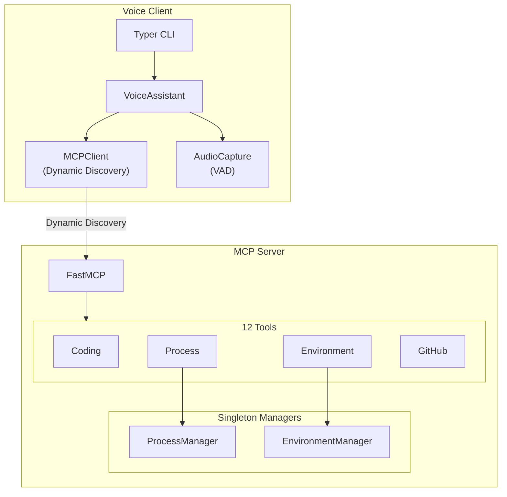

# Claude Code MCP

A lightweight MCP server exposing Claude Code tools via HTTP, with an integrated voice assistant powered by Grok-4.

## Architecture



## Quick Start

```bash
# Install
pip install -e .

# Start server
mcp-server
# or: ./run.sh server

# Start client
voice start
# or: ./run.sh client
```

## Project Structure

```
claude-code-mcp/
├── src/                      # MCP Server
│   ├── main.py               # Entry point (modular tool registration)
│   ├── config.py             # Pydantic settings
│   ├── claude.py             # ClaudeSession (SDK wrapper)
│   ├── environment.py        # EnvironmentManager singleton
│   ├── process.py            # ProcessManager singleton
│   └── github.py             # GitHub API integration
│
├── client/                   # Voice Assistant
│   ├── main.py               # Typer CLI
│   ├── assistant.py          # VoiceAssistant (dynamic tools)
│   ├── mcp_client.py         # Dynamic tool discovery
│   └── audio.py              # AudioCapture with VAD
│
├── pyproject.toml            # Dependencies & entry points
├── envs.json                 # Project environments
└── .env                      # Configuration
```

## MCP Tools

| Category | Tool | Description |
|----------|------|-------------|
| **Coding** | `ask_coder` | Query Claude Code agent |
| | `get_status` | Check agent status |
| | `pop_messages` | Get execution messages |
| **Environment** | `list_environments` | List projects |
| | `get_current_env` | Get active environment |
| | `switch_environment` | Switch context |
| | `create_environment` | Create new project config |
| **Process** | `run_cmd` | Start background process |
| | `stop_cmd` | Stop by PID |
| | `restart_cmd` | Restart process |
| **GitHub** | `get_pr_comments` | Fetch PR comments |
| | `add_pr_comment_respond` | Reply to comment |

## Voice Client

```bash
voice start                    # Full voice mode
voice start --text-only        # Text only
voice start --no-stt           # Type + hear
voice start --no-tts           # Speak + read
voice start --voice rex        # Change voice
```

**Voices:** `ara`, `rex`, `sal`, `eve`, `una`, `leo`

## Dynamic Tool Discovery

The client discovers tools at runtime—no hardcoded definitions:

```python
# Client starts, asks server "What can you do?"
tools = await mcp_client.get_adaptable_tools()
# Returns OpenAI/Grok-compatible function schemas
```

Add a new tool to the server → client sees it immediately.

## Configuration

### `.env`

```bash
XAI_API_KEY=your-key
MCP_BASE_URL=http://127.0.0.1:6030  # or https://your-domain.com
GH_TOKEN=your-github-token          # optional
```

### `envs.json`

```json
{
  "environments": {
    "myproject": {
      "name": "My Project",
      "path": "/path/to/project",
      "run_script": "npm run dev",
      "github_repo": "user/repo"
    }
  }
}
```

## Requirements

- Python 3.10+
- PyAudio: `brew install portaudio && pip install pyaudio`

## License

MIT
