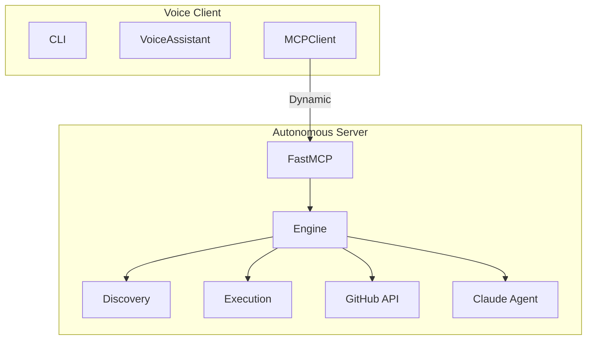

# Claude Autonomous MCP

A zero-config MCP server with auto-discovery, universal GitHub API, and voice assistant.

## Features

- **Auto-Discovery** - Scans filesystem for Git repos, no manual config
- **Universal GitHub API** - Any endpoint via single tool
- **Dynamic Tools** - Client discovers capabilities at runtime
- **Voice Assistant** - STT/TTS powered by Grok-4

## Architecture



## Quick Start

```bash
# Install
pip install -e .

# Configure
cat > .env << EOF
XAI_API_KEY=your-key
GH_TOKEN=your-github-token
SEARCH_PATHS=~/code,~/projects
EOF

# Start server
./run.sh server

# Start voice client
./run.sh client
```

## Tools

| Tool | Description |
|------|-------------|
| `refresh_projects` | Scan filesystem for Git repos |
| `list_projects` | List discovered projects with type and remote |
| `run_in_project` | Execute command in project context |
| `run_shell` | Execute raw shell command anywhere |
| `get_process_stats` | System health and tracked processes |
| `github_api` | Universal GitHub API access |
| `ask_coder` | Claude coding agent |

## Examples

### Auto-Discovery
```bash
# Discovers projects in SEARCH_PATHS
refresh_projects()

# Output:
# Discovered 6 projects:
#   • claude-code-mcp (python)
#   • my-app (node)
#   • rust-cli (rust)
```

### GitHub API
```python
# Create a repo
github_api("POST", "/user/repos", '{"name": "new-repo"}')

# Get PRs
github_api("GET", "/repos/owner/repo/pulls")

# Create issue
github_api("POST", "/repos/owner/repo/issues", '{"title": "Bug"}')
```

### Run Commands
```python
# In a specific project
run_in_project("my-app", "npm install")

# Anywhere
run_shell("docker ps", "~")
```

## Project Structure

```
claude-code-mcp/
├── server/
│   ├── main.py      # FastMCP + 7 tools
│   ├── engine.py    # Discovery, execution, GitHub, Claude
│   └── config.py    # Pydantic settings
├── client/
│   ├── main.py      # Typer CLI
│   ├── assistant.py # Voice assistant
│   ├── mcp_client.py # Dynamic tool discovery
│   └── audio.py     # VAD capture
├── run.sh           # Server/client runner
└── pyproject.toml
```

## Configuration

### `.env`
```bash
XAI_API_KEY=your-xai-key      # Required for voice
GH_TOKEN=ghp_...              # Required for GitHub
SEARCH_PATHS=~/code           # Comma-separated paths
HOST=127.0.0.1               
PORT=6030
```

## Voice Client

```bash
./run.sh client              # Full voice
./run.sh client --text-only  # Text only
./run.sh client --no-tts     # Speak, read output
./run.sh client --no-stt     # Type, hear output
```

## Requirements

- Python 3.10+
- PyAudio: `brew install portaudio && pip install pyaudio`
- Claude SDK (optional): `pip install claude-agent-sdk`

## License

MIT
