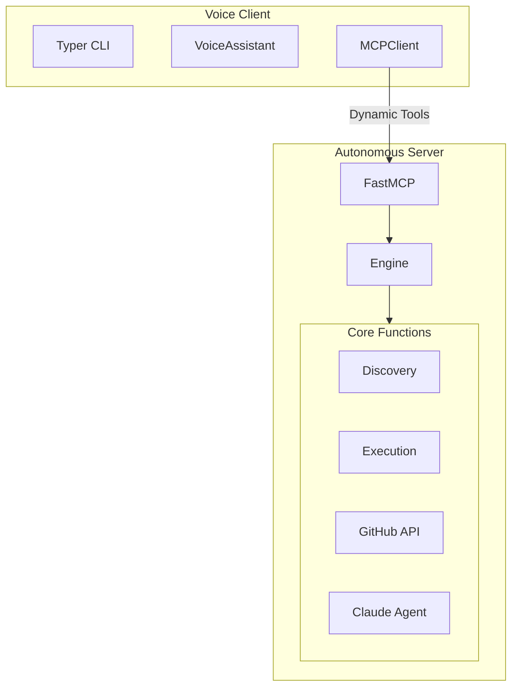

# Claude Autonomous MCP

A zero-config MCP server with auto-discovery, universal GitHub API, and voice assistant.

## Architecture



## Quick Start

```bash
# Install
pip install -e .

# Configure .env
echo "XAI_API_KEY=your-key" > .env
echo "GH_TOKEN=your-token" >> .env
echo "SEARCH_PATHS=~/code,~/projects" >> .env

# Start server
./run.sh server

# Check logs
./run.sh logs

# Stop
./run.sh stop
```

## Tools (7)

| Tool | Description |
|------|-------------|
| `refresh_projects` | Scan filesystem for Git repos |
| `list_projects` | List discovered projects |
| `run_in_project` | Execute command in project |
| `run_shell` | Execute raw shell command |
| `get_process_stats` | System health stats |
| `github_api` | Universal GitHub API |
| `ask_coder` | Claude coding agent |

## Auto-Discovery

The server scans `SEARCH_PATHS` for Git repos and detects:
- **Node**: `package.json`
- **Python**: `pyproject.toml` / `setup.py`
- **Rust**: `Cargo.toml`
- **Go**: `go.mod`

## Universal GitHub API

```python
# Any GitHub API endpoint
github_api("GET", "/repos/owner/repo/pulls")
github_api("POST", "/repos/owner/repo/issues", '{"title": "Bug"}')
github_api("GET", "/user/repos")
```

## Voice Client

```bash
./run.sh client           # Full voice mode
./run.sh client --text-only  # Text only
```

## Configuration

`.env`:
```bash
XAI_API_KEY=your-xai-key
GH_TOKEN=your-github-token
SEARCH_PATHS=~/code,~/projects
HOST=127.0.0.1
PORT=6030
```

## License

MIT
