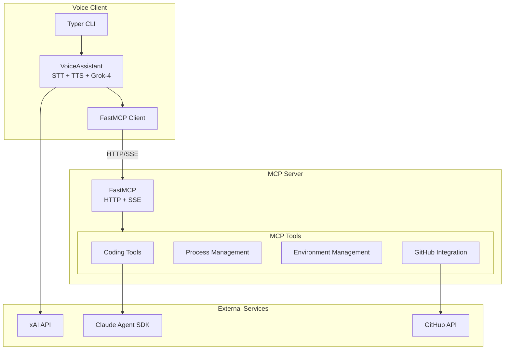
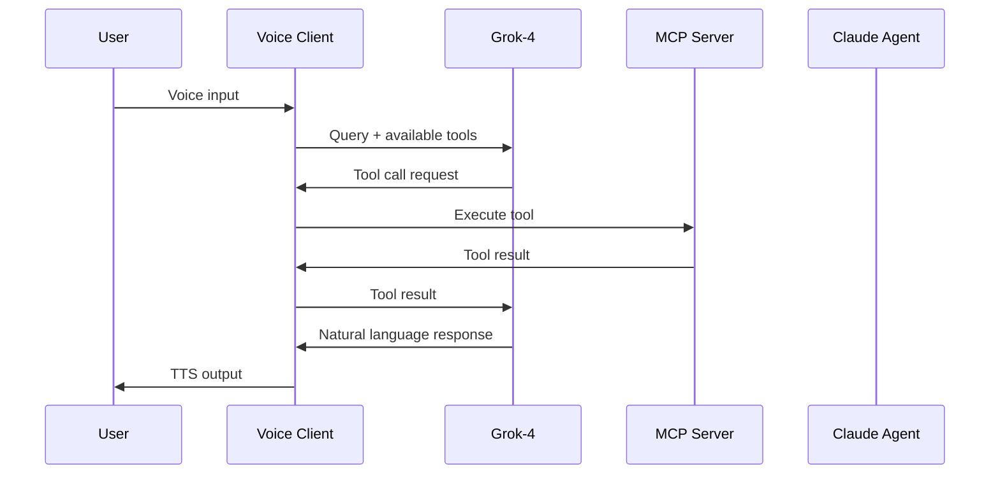

# Claude Code MCP

A lightweight MCP (Model Context Protocol) server that exposes Claude Code tools via HTTP, with an integrated voice assistant powered by Grok-4.

## Architecture



## Quick Start

```bash
# Install
pip install -e .

# Start the server
./run.sh server

# Start the voice client
./run.sh client
```

## Project Structure

```
claude-code-mcp/
├── src/                      # MCP Server
│   ├── main.py               # FastMCP entry point
│   ├── config.py             # Configuration management
│   ├── claude.py             # Claude SDK integration
│   ├── environment.py        # Environment management
│   ├── github.py             # GitHub API integration
│   └── process.py            # Process management
│
├── client/                   # Voice Assistant
│   ├── main.py               # CLI entry point
│   ├── assistant.py          # VoiceAssistant class
│   └── mcp_client.py         # MCP client wrapper
│
├── run.sh                    # Run script
├── envs.json                 # Project environments
└── .env                      # Environment variables
```

## MCP Tools

| Category | Tool | Description |
|----------|------|-------------|
| **Coding** | `ask_coder` | Send query to Claude Code |
| | `get_status` | Check agent status |
| | `pop_messages` | Get execution messages |
| **Environment** | `list_environments` | List configured projects |
| | `get_current_env` | Get active environment |
| | `switch_environment` | Switch project context |
| **Process** | `run_cmd` | Start background process |
| | `stop_cmd` | Stop process by PID |
| | `restart_cmd` | Restart a process |
| **GitHub** | `get_pr_comments` | Fetch PR comments |
| | `add_pr_comment_respond` | Reply to PR comment |

## Voice Client

The voice client provides hands-free interaction with the MCP server via Grok-4.

```bash
./run.sh client                    # Full voice mode
./run.sh client --text-only        # Text only
./run.sh client --no-stt           # Type input, hear output  
./run.sh client --no-tts           # Speak input, read output
./run.sh client --voice rex        # Change voice
```

**Available voices:** `ara`, `rex`, `sal`, `eve`, `una`, `leo`

## Data Flow



## Configuration

### Environment Variables

Create a `.env` file:

```bash
# Required
XAI_API_KEY=your-xai-api-key

# MCP Server URL (local or remote)
MCP_BASE_URL=http://127.0.0.1:6030

# Optional
GH_TOKEN=your-github-token
```

### Project Environments

Configure projects in `envs.json`:

```json
{
  "environments": {
    "myproject": {
      "name": "My Project",
      "path": "/path/to/project",
      "run_script": "npm run dev",
      "github_repo": "user/repo"
    }
  }
}
```

## Requirements

- Python 3.10+
- PyAudio for voice features: `brew install portaudio && pip install pyaudio`

## License

MIT
