# Claude Code MCP

A **minimal, elegant** MCP server for Claude Code with voice assistant capabilities.

```
╔══════════════════════════════════════════════════════════════╗
║  ✅ No Redis required                                        ║
║  ✅ Single pyproject.toml for all dependencies               ║
║  ✅ Unified CLI for voice assistant                          ║
║  ✅ Configurable MCP_BASE_URL for local/remote deployment    ║
╚══════════════════════════════════════════════════════════════╝
```

## Architecture


## Quick Start

```bash
# Install
pip install -e .

# Run MCP Server
./run.sh server

# Run Voice Assistant
./run.sh client                    # Full voice mode
./run.sh client --text-only        # Text input/output
./run.sh client --no-stt           # Type + hear
./run.sh client --voice rex        # Different voice
```

## Directory Structure

```
claude-code-mcp/
├── src/                      # MCP Server
│   ├── main.py               # FastMCP entry point (11 tools)
│   ├── config.py             # Pydantic settings + URL logic
│   ├── claude.py             # ClaudeSession (Claude SDK wrapper)
│   ├── environment.py        # Environment management (envs.json)
│   ├── github.py             # GitHub PR tools (fetch, comment)
│   └── process.py            # ProcessManager (no Redis)
│
├── client/                   # Voice Assistant
│   ├── main.py               # Typer CLI (start, test, devices)
│   ├── assistant.py          # VoiceAssistant (STT/TTS/Grok)
│   └── mcp_client.py         # FastMCP client + tool definitions
│
├── run.sh                    # Unified run script
├── pyproject.toml            # Dependencies (hatch)
├── envs.json                 # Project environments config
├── .env                      # Environment variables
└── .env.example              # Template
```

## MCP Tools

| Tool | Description |
|------|-------------|
| `ask_coder` | Send query to Claude Code agent |
| `get_status` | Check if Claude is running |
| `pop_messages` | Get intermediate messages |
| `list_environments` | List project configs |
| `get_current_env` | Get active environment |
| `switch_environment` | Change environment |
| `run_cmd` | Start background process |
| `stop_cmd` | Stop process by PID |
| `restart_cmd` | Restart process |
| `get_pr_comments` | Fetch PR comments |
| `add_pr_comment_respond` | Reply to PR comment |

## Data Flow

```mermaid
sequenceDiagram
    participant User
    participant Voice as Voice Client
    participant Grok as Grok-4 (xAI)
    participant MCP as MCP Server
    participant Claude as Claude Agent

    User->>Voice: "List my environments"
    Voice->>Grok: Query + tools
    Grok->>Voice: tool_call: list_environments
    Voice->>MCP: call_tool(list_environments)
    MCP->>Voice: environments data
    Voice->>Grok: tool result
    Grok->>Voice: "You have 2 environments..."
    Voice->>User: 🔊 TTS Response
```



## Configuration

### Environment Variables (`.env`)

```bash
# Required
XAI_API_KEY=your-xai-key

# MCP URL Configuration
# Local: http://127.0.0.1:6030 (server binds directly)
# Remote: https://your-domain.com (server at /mcp, client uses /mcp)
MCP_BASE_URL=http://127.0.0.1:6030

# Optional
GH_TOKEN=your-github-token
```

### Project Environments (`envs.json`)

```json
{
  "environments": {
    "myproject": {
      "name": "My Project",
      "path": "/path/to/project",
      "run_script": "npm run dev",
      "github_repo": "user/repo",
      "active_prs": [{"pr_num": 1, "branch_name": "feature"}]
    }
  }
}
```

## Requirements

- Python 3.10+
- PyAudio (for voice): `brew install portaudio && pip install pyaudio`

## License

MIT
