# Claude Code MCP Repository - Complete Analysis

---

## System Architecture Overview

```mermaid
graph TB
    subgraph "User Interfaces"
        Voice["🎤 Voice Assistant<br/>voice_client/"]
        Web["🌐 Web Agent<br/>xai-voice-examples/"]
        Phone["📞 Telephony<br/>Twilio Integration"]
    end
    
    subgraph "AI Layer"
        Grok["🤖 Grok-4<br/>xAI API"]
        Claude["🧠 Claude Code<br/>claude_agent_sdk"]
    end
    
    subgraph "MCP Server (Port 6030)"
        MCP["FastMCP Server<br/>src/main.py"]
        Tools["11 MCP Tools"]
    end
    
    subgraph "Infrastructure"
        Redis["📦 Redis<br/>State Management"]
        GitHub["🐙 GitHub API<br/>PR Comments"]
        Discord["💬 Discord<br/>Notifications"]
    end
    
    Voice --> Grok
    Web --> Grok
    Phone --> Grok
    Grok --> MCP
    MCP --> Claude
    MCP --> Redis
    MCP --> GitHub
    MCP --> Discord
```



---

## 1. Core MCP Server (`src/`)

### Data Flow


---

### [main.py](file:///Users/alhinai/project/claude-code-mcp/src/main.py) - FastMCP Server

**Purpose**: Central HTTP server exposing Claude Code tools via MCP protocol.


| Tool | Arguments | Returns |
|------|-----------|---------|
| `ask_coder` | `query: str` | First response + background note |
| `get_status` | — | `bool` (is running) |
| `pop_messages` | — | JSON with all messages |
| `list_environments` | — | Formatted environment list |
| `switch_environment` | `environment_name: str` | Confirmation |
| `run_cmd` | — | PID of started process |
| `stop_cmd` | `pid: int, force: bool` | Confirmation |
| `restart_cmd` | `pid: int` | New PID |
| `get_pr_comments` | `pr_number: int` | JSON with comments |
| `get_pr_info` | `pr_number: int` | JSON with PR metadata |
| `add_pr_comment_respond` | `pr_number, comment_id, body` | JSON with reply |

---

### [claude.py](file:///Users/alhinai/project/claude-code-mcp/src/claude.py) - Claude SDK Integration

**Purpose**: Manages communication with Claude Code using the agent SDK.


**Key Features**:
- `bypassPermissions` mode - auto-approves all Claude actions
- Background task pattern - returns immediately with first message
- Global message stack for `pop_messages()` retrieval
- Discord notification integration

---

### [process.py](file:///Users/alhinai/project/claude-code-mcp/src/process.py) - Process Management

**Purpose**: Run scripts in background, capture logs to Redis and filesystem.


**Redis Keys**:
- `process:{pid}:info` - Hash with cmd, cwd, started_at, exit_code
- `process:{pid}:logs` - List of JSON log entries

---

### [github.py](file:///Users/alhinai/project/claude-code-mcp/src/github.py) - GitHub Integration

**Purpose**: Fetch and respond to PR comments using PyGithub.

| Function | Description |
|----------|-------------|
| `fetch_review_comments()` | Code-line comments (position-based) |
| `fetch_issue_comments()` | General PR discussion |
| `fetch_pr_comments()` | Combined: both types |
| `fetch_pr_info()` | Full PR metadata (title, body, status, labels) |
| `respond_to_pr_comment()` | Create reply to review comment |

---

### [environment.py](file:///Users/alhinai/project/claude-code-mcp/src/environment.py) - Environment Config

**Purpose**: Load project environments from `envs.json`, manage Redis state.


---

## 2. Voice Client (`voice_client/`)

### Voice Pipeline

```mermaid
flowchart LR
    subgraph Input
        Mic[🎤 Microphone]
    end
    
    subgraph "Speech-to-Text"
        STT[WebSocket<br/>wss://api.x.ai/v1/realtime/audio/transcriptions]
    end
    
    subgraph "Processing"
        Grok[Grok-4<br/>+ MCP Tools]
    end
    
    subgraph "Text-to-Speech"
        TTS[WebSocket<br/>wss://api.x.ai/v1/realtime/audio/speech]
    end
    
    subgraph Output
        Speaker[🔊 Speaker]
    end
    
    Mic --> STT
    STT --> Grok
    Grok --> TTS
    TTS --> Speaker
```



### [voice_assistant.py](file:///Users/alhinai/project/claude-code-mcp/voice_client/voice_assistant.py)

**Class: `VoiceAssistant`**

| Method | Purpose |
|--------|---------|
| `listen_once()` | Capture audio, send to STT, return transcript |
| `ask_grok_with_mcp()` | Send query to Grok-4 with MCP tool access |
| `speak()` | Convert text to speech via TTS WebSocket |
| `conversation_loop()` | Main loop: Listen → Process → Speak |

**Modes**:
```
python voice_assistant.py              # Full voice
python voice_assistant.py --text-only  # Text I/O
python voice_assistant.py --no-stt     # Type + Speak
python voice_assistant.py --no-tts     # Listen + Read
```

---

## 3. Voice Demos (`voice-demo-hackathon/`)

### [demo.py](file:///Users/alhinai/project/claude-code-mcp/voice-demo-hackathon/demo.py) - TTS with Voice Cloning


### [demo_podcast.py](file:///Users/alhinai/project/claude-code-mcp/voice-demo-hackathon/demo_podcast.py) - Multi-Speaker


---

## 4. xAI Examples (`xai-voice-examples-main/`)

### Architecture Comparison

````carousel

<!-- slide -->

<!-- slide -->

````

### Directory Structure

| Path | Type | Description |
|------|------|-------------|
| `examples/agent/web/client/` | React + Vite | Browser frontend |
| `examples/agent/web/xai/backend-python/` | FastAPI | WebSocket proxy |
| `examples/agent/web/xai/backend-nodejs/` | Express | WebSocket proxy |
| `examples/agent/webrtc/server/` | Node.js | WebRTC relay server |
| `examples/agent/telephony/xai/` | Node.js | Twilio integration |
| `examples/stt/python/` | Python | Audio → Text |
| `examples/tts/python/` | Python | Text → Audio |

---

## 5. Configuration

### [envs.json](file:///Users/alhinai/project/claude-code-mcp/envs.json)

```json
{
  "environments": {
    "default": {
      "name": "Project Name",
      "path": "/path/to/project",
      "run_script": "bash run.sh",
      "github_repo": "owner/repo",
      "active_prs": [{"pr_num": 1, "branch_name": "feature"}]
    }
  },
  "current_env": ""
}
```

---

## 6. Requirements Summary


---

## Quick Start Commands

```bash
# 1. MCP Server
redis-server &
cd src && python main.py

# 2. Voice Assistant
cd voice_client
export XAI_API_KEY="your-key"
python voice_assistant.py

# 3. xAI Examples
cd xai-voice-examples-main/examples/tts/python
./start.sh
```
