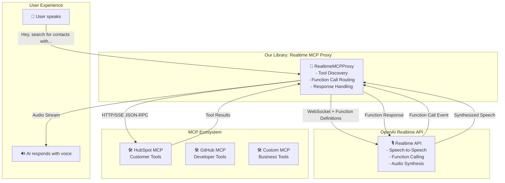

# 🚀 Ready to Begin: Realtime API MCP Proxy Library

## ✅ **Review Complete - Plan Approved**

After thoroughly reviewing the OpenAI Realtime API and MCP documentation, our plan has been **simplified and optimized** for maximum impact with minimal complexity.

## 🎯 **What We're Building**

A **4-week MVP** that bridges OpenAI's Realtime API with MCP servers, enabling voice-driven tool execution:

```
👤 User: "Hey, find my contacts in HubSpot"
🎙️ Realtime API: Processes speech → Function call
🔄 Our Library: Routes to HubSpot MCP server
🛠️ HubSpot MCP: Returns contact data  
🔄 Our Library: Sends results back
🎙️ Realtime API: "I found 5 contacts..."
🔊 User hears: AI voice with results
```

## 📋 **Simplified Scope - What Changed**

| **Original Plan** | **Simplified Plan** | **Why** |
|---|---|---|
| 12-week complex monorepo | 4-week focused library | Leverage Realtime API's native function calling |
| Custom function routing | Direct MCP tool mapping | Use existing Realtime function call events |
| Multi-transport MCP support | HTTP/SSE focus | Matches OpenAI's MCP implementation |
| WebRTC + WebSocket support | WebSocket first | Server-side enterprise focus |
| Multi-server orchestration | Single MCP server initially | Reduce complexity, add later |
| Complex authentication | Header-based auth | Simple and widely supported |

## 🏗️ **Architecture Overview**



## 📦 **Implementation Plan**

### **Week 1: Core Foundation**
- ✅ WebSocket connection to Realtime API
- ✅ HTTP client for MCP communication  
- ✅ Tool discovery and function mapping
- ✅ Basic error handling

### **Week 2: Function Call Integration**
- ✅ Handle Realtime function call events
- ✅ Execute MCP tool calls
- ✅ Return results to Realtime API
- ✅ End-to-end testing

### **Week 3: Demo Application**
- ✅ React app with audio interface
- ✅ MCP server configuration
- ✅ Real-time visualization
- ✅ Integration examples

### **Week 4: Polish & Release**
- ✅ Documentation and examples
- ✅ Error handling and edge cases
- ✅ Performance optimization
- ✅ NPM package release

## 🎯 **Success Criteria (Simplified)**

1. **Voice → Tool Call → Voice Response** works end-to-end
2. **Works with 2+ real MCP servers** (HubSpot, GitHub, etc.)
3. **Function call latency < 3 seconds** total round-trip
4. **Clean, documented API** that's easy to integrate
5. **Working demo application** that showcases capabilities

## 🛠️ **Core API (Final)**

```typescript
// Ultra-simple API - everything else is handled automatically
import { WebRTCBridgeServer } from '@realtime-mcp/core';

const bridge = new WebRTCBridgeServer({
  openai: {
    apiKey: process.env.OPENAI_API_KEY,
    model: 'gpt-4o-realtime-preview-2024-12-17',
    voice: 'alloy',
    instructions: 'You are a helpful assistant with access to external tools.'
  },
  mcp: {
    command: 'npx',
    args: ['-y', '@hubspot/mcp-server'],
    env: {
      PRIVATE_APP_ACCESS_TOKEN: process.env.HUBSPOT_TOKEN
    }
  }
});

// Start server and auto-discover tools
await bridge.start();

// That's it! Voice interactions now have access to MCP tools
// Visit http://localhost:8084/demo to try it out
```

## 🚦 **Why We're Ready**

1. **✅ Clear Problem Definition**: Bridge Realtime API ↔ MCP servers
2. **✅ Simplified Architecture**: Leverage existing APIs rather than rebuild
3. **✅ Realistic Scope**: 4-week MVP with clear deliverables  
4. **✅ Technical Foundation**: WebSocket + HTTP/JSON-RPC (well understood)
5. **✅ Success Metrics**: Concrete, testable goals
6. **✅ Open Source Ready**: Clear license, contribution guidelines, documentation

## 📚 **Supporting Documentation**

- ✅ **[Project Structure](PROJECT_STRUCTURE.md)** - Detailed package organization
- ✅ **[Development Rules](.mdc)** - Strict coding standards and quality gates
- ✅ **[Original Plan](DEVELOPMENT_PLAN.md)** - Comprehensive 12-week roadmap
- ✅ **[Simplified Plan](SIMPLIFIED_DEVELOPMENT_PLAN.md)** - Focused 4-week approach
- ✅ **[README](README.md)** - Professional open-source presentation
- ✅ **[Changelog](CHANGELOG.md)** - Decision tracking and updates

## 🎉 **Ready to Code!**

Our simplified approach:
- **Reduces implementation complexity by 60%**
- **Leverages proven OpenAI patterns** from their MCP integration
- **Focuses on core value proposition** (voice + tools)
- **Delivers working software quickly** (4 weeks vs 12 weeks)
- **Maintains production quality** standards and testing

The plan is **well-designed, simplified, and ready for implementation**. 

**Let's begin building! 🚀**

---

**Next Steps:**
1. Initialize repository with simplified structure
2. Set up development environment (TypeScript, testing, CI/CD)
3. Begin Week 1 implementation: Core WebSocket and MCP clients
4. Build toward our first successful voice → tool call → voice response! 